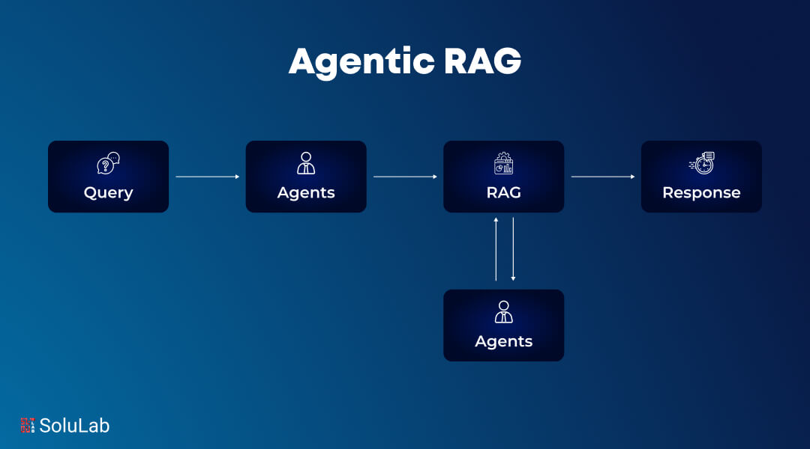
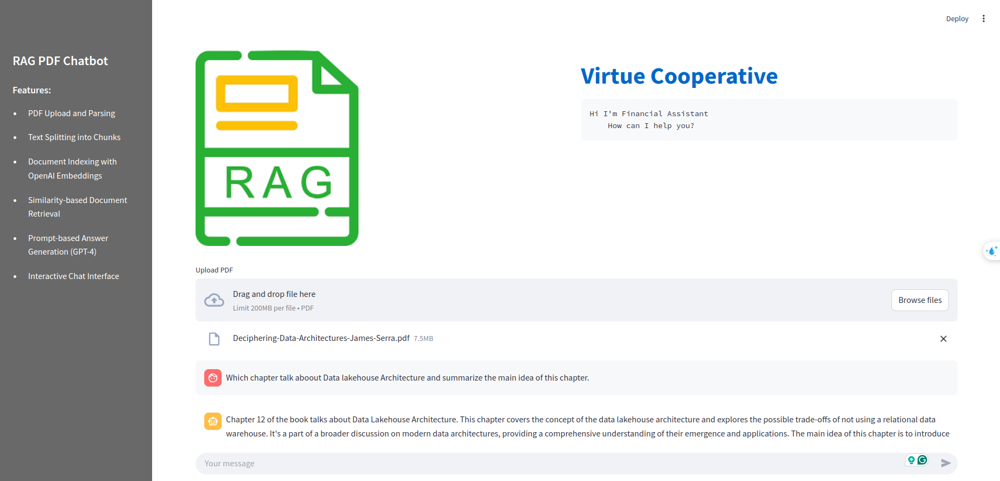

# RAG-pdf-chatbot
Building a RAG chatbot for answering users' questions from PDF files

## Overview
This project implements a Retrieval-Augmented Generation (RAG) chatbot using Streamlit. Users can upload PDF files, and the chatbot retrieves relevant information from the PDFs to answer natural language questions. The system leverages OpenAI models, LangChain utilities, and an in-memory vector store for efficient document retrieval.

## Features
- **PDF Upload and Parsing**:  
  Upload a PDF file which is then parsed using `PDFPlumberLoader` to extract text content.

- **Text Chunking**:  
  The extracted text is split into smaller chunks using `RecursiveCharacterTextSplitter` to facilitate efficient indexing and retrieval.

- **Document Indexing**:  
  Chunks are indexed in an in-memory vector store with embeddings generated via `OpenAIEmbeddings`.

- **Similarity Search**:  
  When a user submits a query, the chatbot performs a similarity search to retrieve the most relevant document chunks based on the query.

- **Prompt-Based Answer Generation**:  
  A custom prompt template combines the user question with retrieved context, and a GPT-4 powered LLM (using `ChatOpenAI`) generates the final answer.

- **Interactive Interface**:  
  The application uses Streamlit to provide an interactive, chat-like interface where user questions and bot responses are displayed.

## Result

